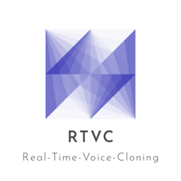

*****


*****

[](https://arxiv.org/pdf/1806.04558.pdf)

## Project description

``Real-Time-Voice-Cloning`` is a vocoder-based real-time implementation of the scientific work described in the paper
"Transfer Learning from Speaker Verification to Multispeaker Text-To-Speech Synthesis" (``SV2TTS``). ``SV2TTS`` is a three-stage
Deep Learning Framework, allowing users to create numerical representations of human voices from just a few second long
audio files and to train Text-to-Speech models capable of transfering voice characteristics to new texts.

## Implemented Papers & Research

| URL | Designation | Title | Implementation source |
| --- | ----------- | ----- | --------------------- |
|[**1806.04558**](https://arxiv.org/pdf/1806.04558.pdf) | **SV2TTS** | **Transfer Learning from Speaker Verification to Multispeaker Text-To-Speech Synthesis** | This repository |
|[1802.08435](https://arxiv.org/pdf/1802.08435.pdf) | WaveRNN (vocoder) | Efficient Neural Audio Synthesis | [fatchord/WaveRNN](https://github.com/fatchord/WaveRNN) |
|[1703.10135](https://arxiv.org/pdf/1703.10135.pdf) | Tacotron (synthesizer) | Tacotron: Towards End-to-End Speech Synthesis | [fatchord/WaveRNN](https://github.com/fatchord/WaveRNN)
|[1710.10467](https://arxiv.org/pdf/1710.10467.pdf) | GE2E (encoder)| Generalized End-To-End Loss for Speaker Verification | This repository |

## License

This package is licensed under ``MIT``.

## Installation & Setup

### Main Prerequesites

- ``Python (3.6 or 3.6)``
- ``PyTorch (>= 1.1.0)``
- ``ffmpeg``

To install all other dependencies, run the following command from the repository's root directory.

```python
pip install -r requirements.txt
```

### CUDA Information

If you have a ``CUDA``-capable Graphics Card (``Nvidia``) that you want to use for training, preprocessing or accelearated file operations, you need to follow these steps:

1. Make sure to install/update the cuda-toolkit in your environment (e.g. via ``pip`` or ``conda``).
2. Check your CUDA version by terminal-typing either ``nvidia-smi`` or ``nvcc --version``.
3. Download a ``PyTorch`` version that supports your CUDA version.

### Downloading pre-trained Models

The latest models can be downloaded [here](https://github.com/CorentinJ/Real-Time-Voice-Cloning/wiki/Pretrained-models).

### Downloading datasets (*optional*)

When playing around with the ``Toolbox`` alone, downloading ``LibriSpeech/train-clean-100`` is recommended. Download the
data and extract the files in a directory of your choice. The path to the data should look like this: ``<your_dir>/LibriSpeech/train-clean-100``.

Other training datasets supported by the ``Toolbox`` can be found [here](https://github.com/CorentinJ/Real-Time-Voice-Cloning/wiki/Training#datasets).

Note: In case you choose not to download one of the provided datasets, you need to use your own audio files or record such in the ``Toolbox``.

## Usage

### Test Configuration & CLI

Before downloading a dataset, you can test your configurations with ``demo_cli``. To run the script type ``python demo_cli.py`` from the
repository's root directory. In case all tests passed, you are good to go.

### Toolbox

``Real-Time-Voice-Cloning`` provides a simple and user-friendly GUI allowing for imports of audio files, model training and Speech-to-Text output.

To start the toolbox type either ``python demo_toolbox.py -d <your_dir>`` if you downloaded datasets prior or ``python demo_toolbox.py`` if you didn't
download any dataset. In case you are running an X-server or if encountering the error ``Aborted (core dumped)``, see [here](https://github.com/CorentinJ/Real-Time-Voice-Cloning/issues/11#issuecomment-504733590).

To watch an introductory **Video Demonstration** of the **Toolbox** and its main features, click on the picture:
[](https://www.youtube.com/watch?v=-O_hYhToKoA)

## News & Announcements

**14/02/21**: This repo now runs on PyTorch instead of Tensorflow, thanks to the help of @bluefish. If you wish to run the tensorflow version instead, checkout commit `5425557`.

**13/11/19**: I'm now working full time and will therefore not maintain this repository anymore. To anyone reading this:

- **If you just want to clone your voice (and not someone else's)**, I recommend the free plan on [Resemble.AI](https://www.resemble.ai/). You will get a better voice quality and less prosody errors.
- **If this is not your case**, proceed with this repository but you might end up being disappointed by the results. If you're planning to work on a serious project, my strong advice is to find another TTS repo. Visit [](https://github.com/CorentinJ/Real-Time-Voice-Cloning/issues/364) for more information.

**20/08/19:** I'm working on [resemblyzer](https://github.com/resemble-ai/Resemblyzer), an independent package for the voice encoder. You can use your trained encoder models from this repo with it.

**06/07/19:** Need to run within a docker container on a remote server? See [here](https://sean.lane.sh/posts/2019/07/Running-the-Real-Time-Voice-Cloning-project-in-Docker/).

**25/06/19:** Experimental support for low-memory GPUs (~2GB) added for the synthesizer. Pass `--low_mem` to `demo_cli.py` or `demo_toolbox.py` to enable it. Due to adding a big overhead, it's not recommended if you have enough VRAM.

## Source code & further information

The source code is maintained at https://github.com/CorentinJ/Real-Time-Voice-Cloning  

Check out [my scientific thesis](https://matheo.uliege.be/handle/2268.2/6801) if you are curious or looking for information not provided in detail here.  
I especially recommend taking a look at the figures beyond the introductions.
